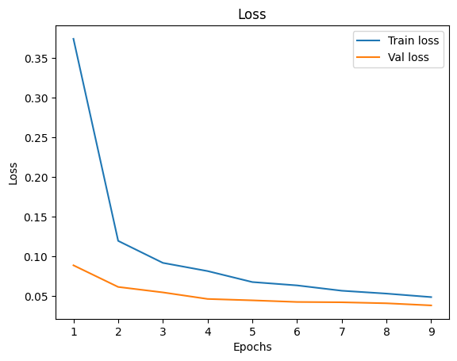
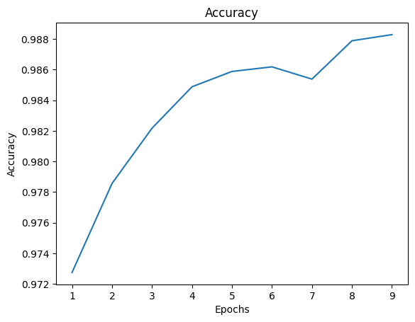
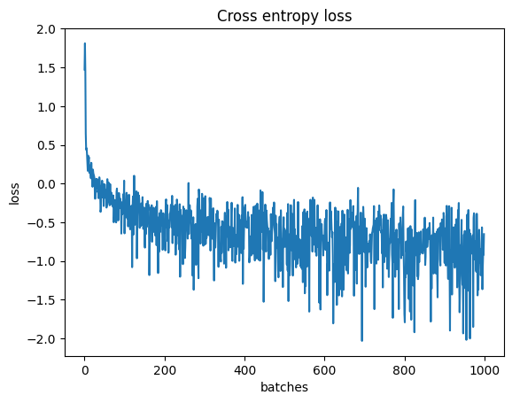

# Digit Recognition using CNN
Implemented digit recognition using convolution neural networks, optimized using SGD.
Achieved a validaiton accuracy of 98.8% in 10 epochs.

- Used minibatch gradient descent 
- Used Nesterov momentum

## Training and validation loss per epochs: 
  

## Validaiton accuracy per epoch:  

## Losses per batch:  

